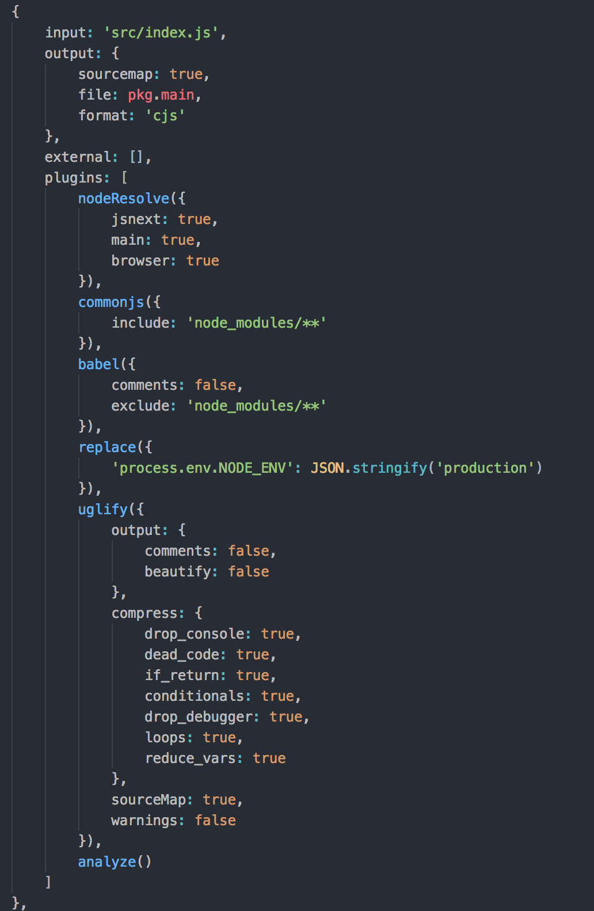
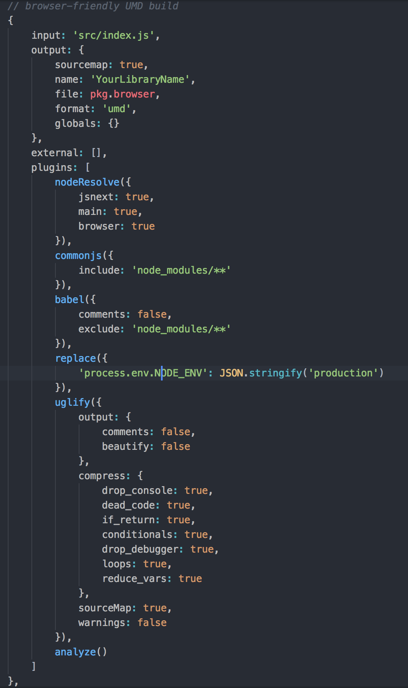
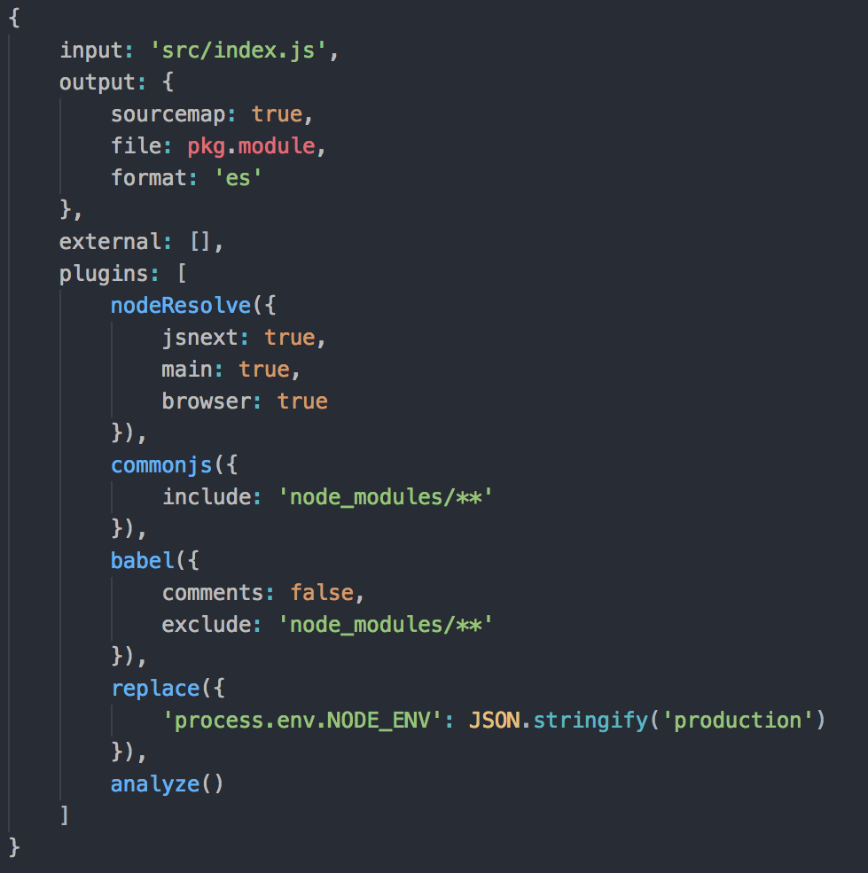

export { custom as theme } from './theme.js';
import { Head } from 'mdx-deck';

<Head>
  <title>¿Cómo implementar una librería? </title>
</Head>

# ¿Cómo implementar una librería? 
# :thinking_face: :sunglasses: 

---

## ¿Qué ventajas nos da una librería? :thinking_face: :nerd_face:

1. Nos permite simplificar la resolución de un problema especifico.
2. Nos permite simplificar la reutilización de código cross-project.
3. Nos permite simplificar las mejoras de código legacy.

---

## ¿Qué desventajas nos da una librería? :thinking_face: :neutral_face:

1. Nos trae la dificultad de añadir mucho más setup. 
2. Nos trae la dificultad de como comprobar que la estructura de nuestra librería funciona con los proyectos donde intentamos integrarlo.
3. Nos trae la dificultad de pensar como mantener adecuadamente SEMVER. 

---
import Box from 'superbox';

## Pasemos a la implementación! :scream:

Para comenzar, forkeen el siguiente repo: 

<Box
    fontSize={25}
    color='white'
    bg='#311B92'
    py={4}
    px={3}
    css={{
        borderRadius: 4
    }}
>
    https://github.com/JonatanSalas/library-boilerplate
</Box>

Hagan un clone de su fork y corran un: 

<Box
    fontSize={25}
    color='white'
    bg='#311B92'
    py={4}
    px={3}
    css={{
        borderRadius: 4
    }}
>
    npm install
</Box>

---

## Estructura para armar una librería :scream:

Estos son los **archivos/directorios** más importantes:

- **src** → acá va a estar todo el código
- **src/index.js** → punto de entrada de la librería
- **test** → acá vamos a tener los test-cases para el código
- **.babelrc** → acá especificamos config para `babel`
- **rollup.config.js** → acá especificamos config para `Rollup`

---
## ¿Qué es Rollup? :thinking_face:


**Rollup** es un module bundler. Tan simple como eso. 

Pará, ¿Khé es un **Module Bundler**?

Un module bundler, es un software que se encarga de resolver las dependencias de una aplicación/librería dado un punto de entrada determinado. (Ej: Webpack)

---
## ¿Por qué Rollup y no Webpack entonces? :thinking_face:

`Rollup` nació como un proyecto dedicado especificamente a optimizar la forma en la que buildeamos librerías para Javascript.

En cambio, `Webpack`, nació como un proyecto dedicado especificamente a optimizar la forma en la que buildeamos las aplicaciones.

---
## Veamos Código

Esto es el contenido del código del archivo `rollup.config.js` :scream:

```javascript
import commonjs from './rollup/config.cjs';
import umd from './rollup/config.umd';
import esm from './rollup/config.esm';

export default [umd, commonjs, esm];
```

---
## ¿Por qué exporta un Array la configuración? :thinking_face:

En `Rollup` a diferencia de Webpack, la configuración se exporta como un array.
La posta es que permite exportar tu librería a diferentes formatos:

- Commonjs
- UMD (Universal Module Declaration)
- ESM (ES6 Modules)

Entonces, vos vas a configurar el file `rollup.config.js` en base a eso, al tipo de módulo al que vos quieras como **target**.

---
## ¡Hagamos un parate!

### ¿Por qué hay tantos formatos de Modulos para Javascript? :neutral_face:

La triste realidad es que el `browser` y `node` tienen diferencias en cuanto al diseño de sus APIs. 

Lo bueno de esto, es que, con la evolución de Javascript comenzo a nacer `ESM`, 
alias ES6 Modules, y creo que vamos bien encaminados.

---

## ¡Volvamos al código!

Dentro del `package.json` de sus librerías van a implementar el tipo de módulo, con esto le dicen a NPM 
que módulo va a tener que cargar dependiendo del entorno en donde vos estés.

```javascript
//Your library package.json
{
  "main": "lib/yourLibraryName.cjs.js",
  "module": "lib/yourLibraryName.esm.js",
  "browser": "lib/yourLibraryName.umd.js",
}
```

---
### Configuración para Commonjs



---
### Configuración para UMD



---
### Configuración para ESM

